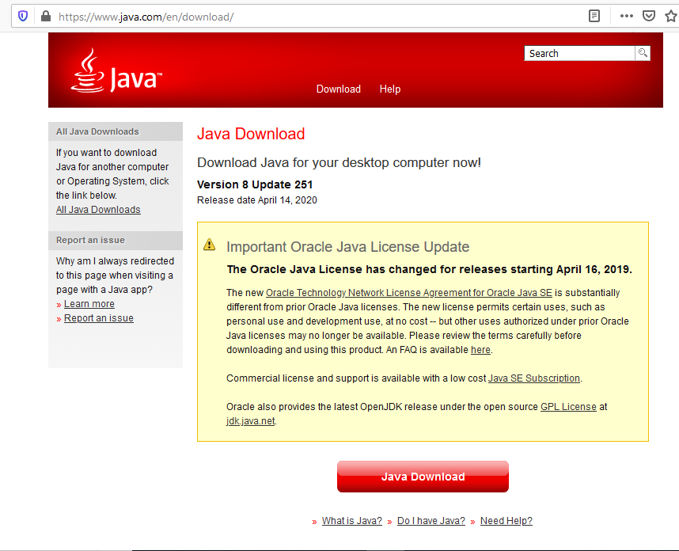
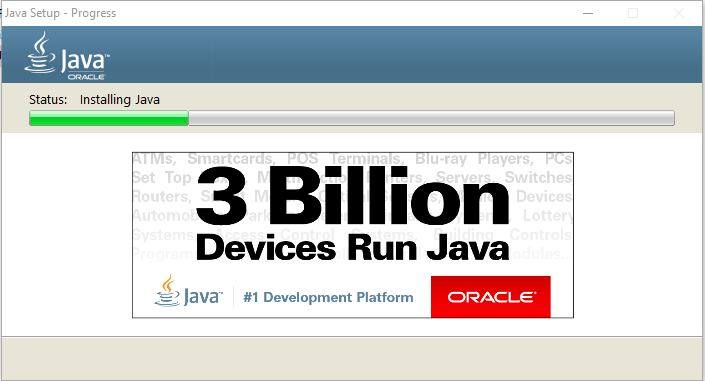
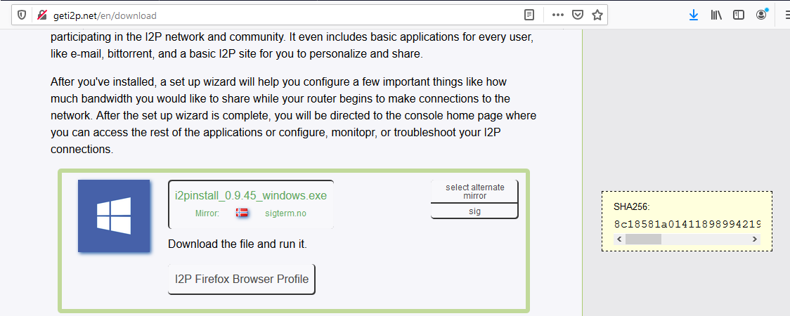
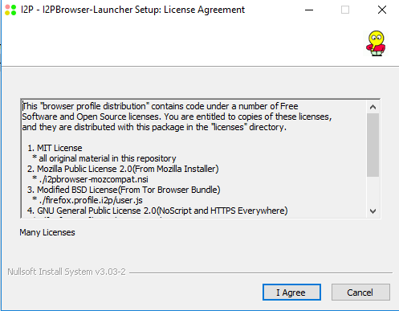
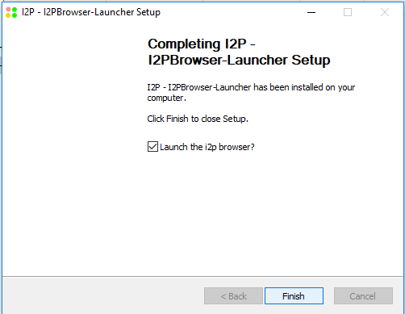

Installing I2P, its dependencies, and recommended external software on Windows 10
=================================================================================

Getting I2P installed and configured on Windows has at times been a process which
left many of our potential users confused. As power-users and developers, this
issue is sometimes invisible to us. So to get a better impression of what the
experience is for a new I2P user, I installed an unfamiliar OS on an old laptop
and undertook the install process, from start to finish.

What? An unfamiliar OS? How is that useful?
-------------------------------------------

Relax, it's Windows.

So what are we going to do here?
--------------------------------

We're going to finish four tasks. We are going to:

 1. [Install Java](#part-one-install-java)
 2. [Install I2P](#part-two-install-i2p)
 3. [Install a Real Browser(Firefox)](#part-three-install-a-real-browserfirefox)
 4. [Configure I2P Bandwidth](#part-four-configure-i2p-bandwidth)

### Part One: Install Java

If you already have java installed, you may [Skip This Step](#part-two-install-i2p)

1. 
2. 
3. 
4. 
5. 
6. 
7. 

### Part Two: Install I2P

1. 
2. 
3. 
4. 
6. 
7. 
8. 
9. 

### Part Three: Install a Real Browser(Firefox)

If you already have Firefox installed, you may [Skip This Step](#part-four-configure-i2p-bandwidth)

1. 
2. 
3. 
4. 
5. 
6. 

### Part Four: Configure I2P Bandwidth

