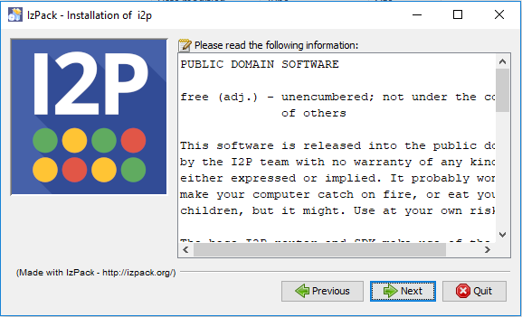
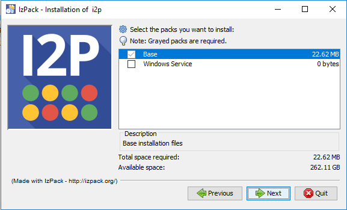
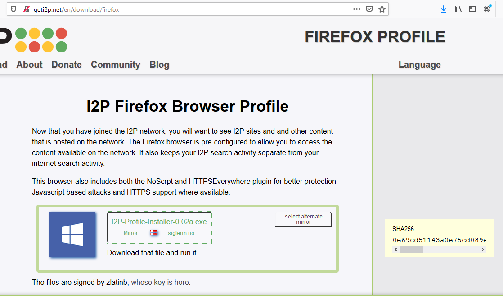

Installing I2P, its dependencies, and recommended external software on Windows 10
=================================================================================

Getting I2P installed and configured on Windows has at times been a process which
left many of our potential users confused. As power-users and developers, this
issue is sometimes invisible to us. So to get a better impression of what the
experience is for a new I2P user, I installed an unfamiliar OS on an old laptop
and undertook the install process, from start to finish.

This is deliberately the most detailed version of this guide I could justify as 
in-scope, some steps might be redundant on computers that have already been in
use for some time.

What? An unfamiliar OS? How is that useful?
-------------------------------------------

Relax, it's Windows.

So what are we going to do here?
--------------------------------

We're going to finish four tasks. We are going to:

 1. [Install Java](#part-one-install-java)
 2. [Install I2P](#part-two-install-i2p)
 3. [Install a Real Browser(Firefox)](#part-three-install-a-real-browserfirefox)
 4. [Configure I2P Bandwidth](#part-four-configure-i2p-bandwidth)

### Part One: Install Java

If you already have java installed, you may [Skip This Step](#part-two-install-i2p)

1. I2P requires Java to run, if you don't have Java installed, you will get an error
 that looks like this: 
2. We appreciate that you have a wide range of choices in Java software, but the Oracle
Java software is the easiest to install and use with I2P on Windows. Please use this
version. 
3. Download it from here: 
4. Double-click the Java Installer you just downloaded. Don't set a custom path, just
use the default one. 
5. Java will show you some information about what it is and where it runs while you
wait for it to finish installing. 
6. When you see this, Java is almost installed. 
7. Java is now installed! 

### Part Two: Install I2P

1. Download I2P from [https://geti2p.net](https://geti2p.net). 
2. I2P is available in many languages. Select one that is familiar to you. 
3. On the first screen, we introduce our software. 
4. I2P is mostly public domain software, with permissive licenses and a small amount of GPL2'ed
Free Software. 
6. You should probably leave I2P installed at the default path, as it is easiest to work with this
way. 
7. Check "Install Windows Service" to run I2P automatically on your computer. 
8. I2P will copy it's files into the install location. 
9. I2P is now installed! 

### Part Three: Install a Real Browser(Firefox)

If you already have Firefox installed, you may [Skip This Step](#part-four-configure-i2p-bandwidth)

1. Get Firefox from [htps://mozilla.org](https://mozilla.org) 
2. Run the installer. 
3. Download the Firefox Profile Bundle from the I2P Web Site. 
4. Select the language you want to use for the install process. 
5. The Profile Bundle incorporates lots of external software, so it has a detailed license 
document. 
6. You now have a browser ready for I2P! 

### Part Four: Configure I2P Bandwidth

