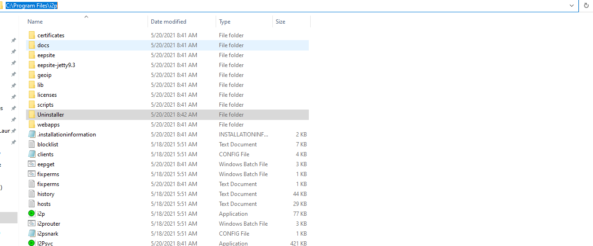
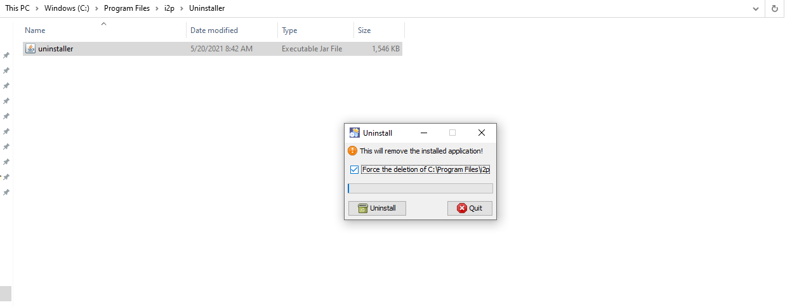
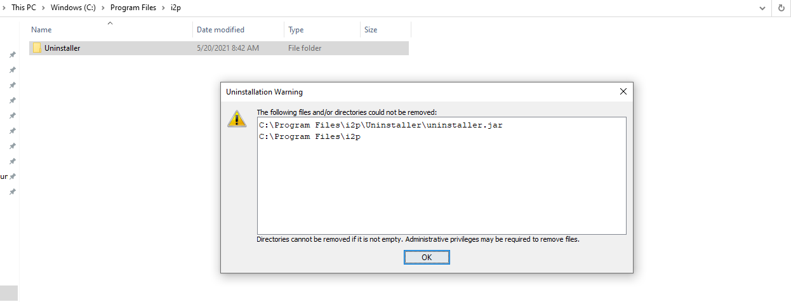
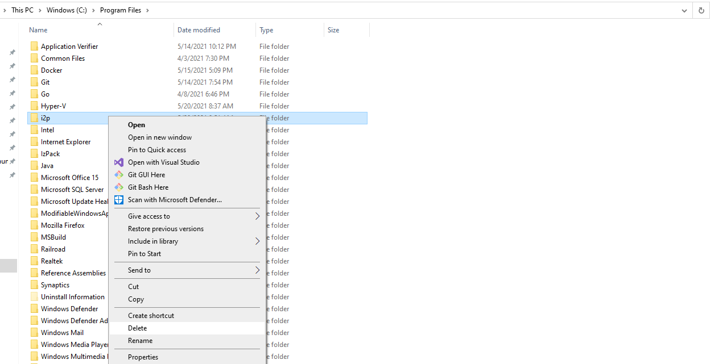

Unstalling I2P from Windows 10 and other Windows Systems
========================================================

What are the steps?
-------------------

 - Uninstall I2P
 - Delete User Data

### Part One: Uninstall I2P

This is the uninstall process which works for me:

1. First, find the `C:\Program Files\I2P\Uninstaller` directory which contains the uninstaller:
  - 
2. Start the uninstaller by double-clicking, or by right-clicking and selecting `Open`.
  - 
3. Run the uninstaller. Optionally, you can try and force this to remove the install directory too,
 had an issue getting this to work reliably due to the directory being in use(Open in Windows Explorer),
 with the uninstaller running in it.
  -  
4. Now you're done uninstalling I2P, the I2P software has been removed from your computer.
  - 
5. Optionally, delete the install directory at `C:\Program Files\I2P\`.
  - 

### Part Two: (Optionally backup and) Delete User Data

Your I2P user data is probably still in your user profile. If you want to use I2P
on another system, you can copy this directory to migrate your settings. You should
optionally back up the contents of this directory, and may wish to delete the
directory.

1. Find your user application data in the application data directory, which is at:
 `C:\Users\youruser\AppData\Local` in a directory called `I2P`.
2. Once you have found the data, you should either delete the old data:
  - 
2. Or back it up to another device to use it again.
  - 

